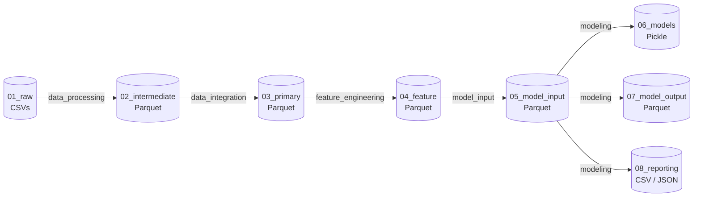

# Pronóstico de Ventas Retail con LightGBM y Kedro

Pipeline de pronóstico de ventas diarias por tienda y categoría sobre datos de operaciones retail en múltiples regiones de México (~14 meses, enero 2023 – febrero 2024).

## Problema

Pronosticar el monto de ventas diario (`amount_total`) a nivel tienda × categoría para un horizonte de corto plazo. El problema se aborda con un modelo tabular global entrenado sobre todas las series simultáneamente, en lugar de modelos independientes por serie.

## Enfoque

- **Modelo principal**: LightGBM global con 32 features (lags, rolling statistics, variables de calendario, atributos de tienda y categoría)
- **Baseline**: lag semanal (`amount_total_lag_7`) — predicción naive de 7 días atrás
- **Validación**: holdout temporal — entrenamiento 2023, prueba enero–febrero 2024
- **Prevención de leakage**: lags y rolling calculados con `shift` dentro de grupo; columnas contemporáneas excluidas

## Resultados (holdout enero–febrero 2024)

| Métrica | Baseline (lag 7d) | LightGBM | Mejora |
|---------|:-----------------:|:--------:|:------:|
| MAE | 56,929 | 49,426 | −13.2% |
| RMSE | 130,986 | 78,373 | −40.2% |
| sMAPE | 32.0% | 30.3% | −5.5% |
| MAE relativo | 39.9% | 34.7% | −5.2 pp |

La mayor mejora se concentra en RMSE, lo que indica que LightGBM reduce significativamente los errores extremos.

## Arquitectura

El proyecto usa [Kedro](https://kedro.org) con arquitectura medallion en cinco pipelines secuenciales:



| Pipeline | Responsabilidad |
|----------|----------------|
| `data_processing` | Enforcement de schema, tipado estricto → Parquet |
| `data_integration` | Join transacciones × tiendas × calendario, validación de unicidad |
| `feature_engineering` | Lags y rolling statistics por grupo tienda-categoría |
| `model_input` | Separación temporal train/test, validación de leakage |
| `modeling` | Entrenamiento LightGBM, evaluación, métricas por segmento, feature importance |

## Stack

- Python 3.13
- Kedro 1.3.1
- LightGBM 4.x
- scikit-learn 1.4+
- pandas 2.2+, numpy, pyarrow
- JupyterLab

## Instalación

```bash
# 1. Clonar el repositorio
git clone <repo-url>
cd reto-tecnico-WM
```

**Opción A — con [uv](https://docs.astral.sh/uv/getting-started/installation/) (recomendado):**
```bash
uv venv .venv --python 3.13
source .venv/bin/activate   # Linux/Mac
pip install -e retowm/
```

**Opción B — con Python estándar:**
```bash
python3.13 -m venv .venv
source .venv/bin/activate   # Linux/Mac
pip install -e retowm/
```

Los datos crudos (`transactions.csv`, `stores.csv`, `calendar.csv`) ya están incluidos en el repositorio en `retowm/data/01_raw/`.

## Ejecución

> **Nota:** se usa `python -m kedro` en lugar del comando `kedro` directamente para asegurar que se ejecuta con el intérprete del entorno virtual activo.

Todos los comandos se ejecutan desde dentro de `retowm/` con el entorno activado:

```bash
source .venv/bin/activate   # Linux/Mac — omitir si ya está activo
cd retowm/

# Pipeline completo (Bronze → Reporting)
python -m kedro run

# Pipeline individual (en orden)
python -m kedro run --pipelines data_processing
python -m kedro run --pipelines data_integration
python -m kedro run --pipelines feature_engineering
python -m kedro run --pipelines model_input
python -m kedro run --pipelines modeling

# Linting
ruff check src/
```

## Visualización del pipeline

[Kedro Viz](https://docs.kedro.org/projects/kedro-viz/) genera una visualización interactiva del pipeline de datos en el navegador:

```bash
# Desde retowm/ con el entorno activado
python -m kedro viz
```

Abre automáticamente `http://localhost:4141` mostrando el grafo completo de datasets, nodos y dependencias.

> Requiere las dependencias de desarrollo: `pip install -e retowm/[dev]`

## Notebooks

Los notebooks requieren acceso al catálogo de Kedro. Lanzar con:

```bash
# Desde retowm/
python -m kedro jupyter lab
```

| # | Notebook | Contenido |
|---|----------|-----------|
| 1 | `01_eda_problem_framing.ipynb` | Análisis exploratorio y definición del problema |
| 2 | `02_business_results.ipynb` | Resultados orientados a negocio |
| 3 | `03_technical_results.ipynb` | Validación técnica: métricas, segmentos, importancia de variables, sanity checks |

Se recomienda leerlos en ese orden: el primero establece el contexto del problema, el segundo presenta los resultados para una audiencia no técnica, y el tercero profundiza en la validación técnica del modelo.

## Autor

Gamaliel Torres
